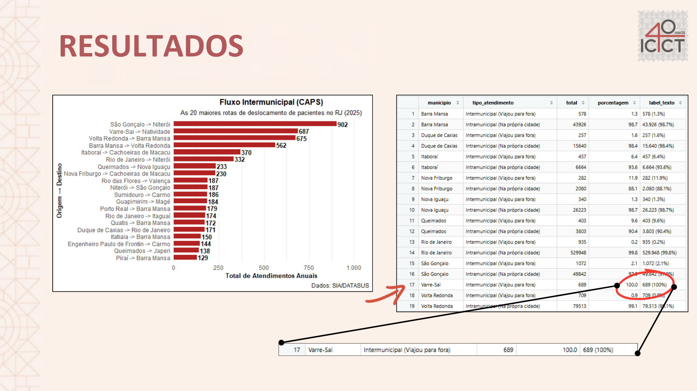
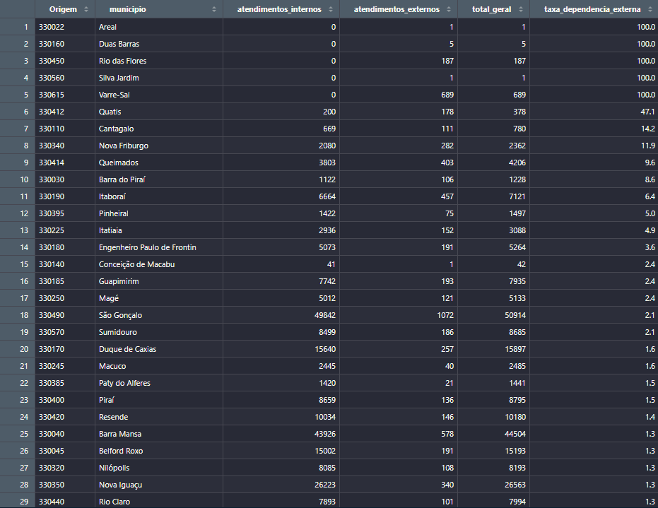
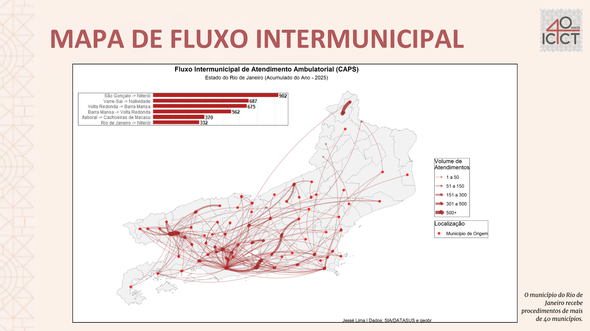

# Territorialização e Fluxos da Rede de Atenção Psicossocial (RAPS) no Estado do Rio de Janeiro
### Análise Espacial de Deslocamentos Ambulatoriais em CAPS utilizando Microdados do SIA/DATASUS (2025)

---

## 1. Contextualização e Objetivo:
* A regionalização, descentralização e hierarquização constituem princípios do Sistema Único de Saúde (SUS) para assegurar o acesso integrado, equitativo e territorializado aos serviços de saúde. No âmbito da Rede de Atenção Psicossocial (RAPS), os Centros de Atenção Psicossocial (CAPS) desempenham papel estratégico na oferta de cuidado comunitário às pessoas com sofrimento ou transtorno mental e necessidades decorrentes do uso prejudicial de álcool ou outras drogas.
* Este repositório apresenta o pipeline analítico e cartográfico desenvolvido para avaliar a territorialização e acessibilidade da Rede de Atenção Psicossocial (RAPS) no Estado do Rio de Janeiro em 2025. Por meio do processamento de 1.608.875 procedimentos ambulatoriais do SIA/DATASUS (Forma de Organização 03.01.08 do SIGTAP - Atendimento/Acompanhamento Psicossocial), o projeto mapeia matrizes de fluxo Origem-Destino (O-D) para quantificar a capacidade de retenção intra e intermunicipal da assistência dos CAPS a fim de diagnosticar áreas de vazio assistencial e dependência externa absoluta. O código visa oferecer ferramentas reprodutíveis de análise espacial para pesquisadores e gestores do Sistema Único de Saúde (SUS).
* Esse trabalho foi desenvolvido como Projeto Final do Curso de Inverno em Introdução à Linguagem R com Dados de Saúde, ofertado pelo ICICT/Fiocruz e ministrado pelo professor Raphael Saldanha, desenvolvedor do pacote microdatasus. Além disso, submeti o presente estudo à publicação para o II Workshop de Geografia da Saúde da UERJ no formato de Resumo Simples.
* Para a realização desse projeto utilizei o RStudio com os pacotes:
  - 1.1 **microdatasus:** processamento e pré-processamento dos microdados do DATASUS.
  - 1.2 **geobr:** download das malhas do estado e dos municípios, com as informações de latitude e longitude.
  - 1.3 **ggplot2:** elaboração de mapas e gráficos.
  - 1.4 **sf:** operações geográficas (centróides dos municípios).
  - 1.5 **tidyr:** limpeza dos valores nulos (NA).
  - 1.6 **dplyr:** tratamento dos dados.
  - 1.7 **stringr:** manipulação de strings.
---

## 2. Destaques e Achados Territoriais:
* **Fluxo Intramunicipal (Alta Retenção):** Dos 1.608.875 procedimentos ambulatoriais de atenção psicossocial analisados no estado em 2025, **99,4%** ocorreram dentro do próprio município de residência do usuário. Esse índice evidencia uma expressiva eficácia geral da regionalização da RAPS no Rio de Janeiro, com redes locais absorvendo a quase totalidade da demanda e cumprindo a premissa do cuidado comunitário territorializado. Municípios como Rio de Janeiro, São João de Meriti e Volta Redonda lideram o ranking de maior volume absoluto de atendimentos à própria população.

* **Fluxo Intermunicipal (Vazios Assistenciais):** Os **0,6%** restantes do volume estadual (**n= 9.415**) corresponderam a deslocamentos intermunicipais, onde a maior parte dos municípios exportaram poucos procedimentos quando comparado ao seu volume total.

* Para identificar se os deslocamentos intermunicipais eram relevantes ou não, foi criado uma tabela de porcentagem dos destinos que eram iguais a origem (==) do município e os que eram diferentes (!=).

* **Dependência Externa Absoluta (100%):** A análise de rede identificou municípios de pequeno porte com ausência ou insuficiência de fixação de cuidado local. **Varre-Sai** respondeu por **7,32%** de todo o tráfego intermunicipal fluminense, encaminhando 100% de sua demanda psicossocial para fora (sendo 99,7% absorvidos pelo município vizinho de Natividade) Da mesma forma, **Rio das Flores** apresentou 100% de dependência assistencial externa, exportando integralmente seus pacientes para Valença. O terceiro município que mais exportou pacientes foi Quatis, com **47,1%** dos procedimentos realizados em outras localidades (**n= 178**).
obs.: Municípios que apresentaram 100% de dependência, mas tiveram baixo fluxo de procedimentos foram desconsiderados.
---

## 3. Cartografia dos Fluxos na RAPS (Rio de Janeiro - 2025):
* **Pressão Metropolitana e Centralidade:** Em termos absolutos de tráfego intermunicipal, a rota **São Gonçalo → Niterói** registrou o maior volume de evasão de pacientes no estado (**n = 1.902 procedimentos**). O achado evidencia a intensa conurbação socioespacial e o papel de referência regional exercido pela rede especializada de Niterói na Região Metropolitana II, mesmo considerando que São Gonçalo apresenta uma taxa de retenção interna de 97,9%.
* **Munícipio com Maior Recepção de Procedimentos:** A capital do estado, Rio de Janeiro, recebeu procedimentos encaminhados de mais de 40 municípios, liderando como o município que mais recepcionou os demais, além de ter liderado o maior fluxo intramunicipal (**n= 529.948**).
* **Modelagem Cartográfica dos Deslocamentos:** Para mapear a dinâmica intermunicipal sem sobreposição visual excessiva, os centroides municipais (extraídos da malha do Censo 2022/IBGE via pacote `geobr`) foram conectados por arcos direções (`geom_curve` no `ggplot2`). A espessura (`linewidth`) e a opacidade (`alpha`) das curvas foram escalonadas em cinco faixas de volume ambulatorial anual, permitindo identificar graficamente desde fluxos residuais até os principais eixos de mobilidade de pacientes em busca de assistência especializada.

---

## 4. Script Para Reprodução:
   * Abra o arquivo [`proj_caps_rj.qmd`](proj_caps_rj.qmd) no RStudio.
   * O código é estruturado como um R Markdown, integrando as narrativas do estudo aos *chunks* de processamento dos microdados do DATASUS (`microdatasus`), agregação das matrizes de fluxo e modelagem cartográfica em alta resolução (`geobr` e `ggplot2`).
   * O primeiro código foi estruturado para evitar que seja necessário realizar o download de mês a mês do SIA/SUA para o procedimento selecionado, pois cada mês possuí mais de 5 milhões de linhas. A estrutura de código realizada permite que você consiga baixar sem travar, pois realiza uma limpeza automática junto ao donwload das tabelas com as variáveis de escolha previamente selecionadas.
   * Sinta-se livre para rodar linha por linha ou bloco por bloco de código, mas, não se esqueça de citar na bibliografia o autor do trabalho, assim como os autores dos respectivos pacotes utilizados ;).
