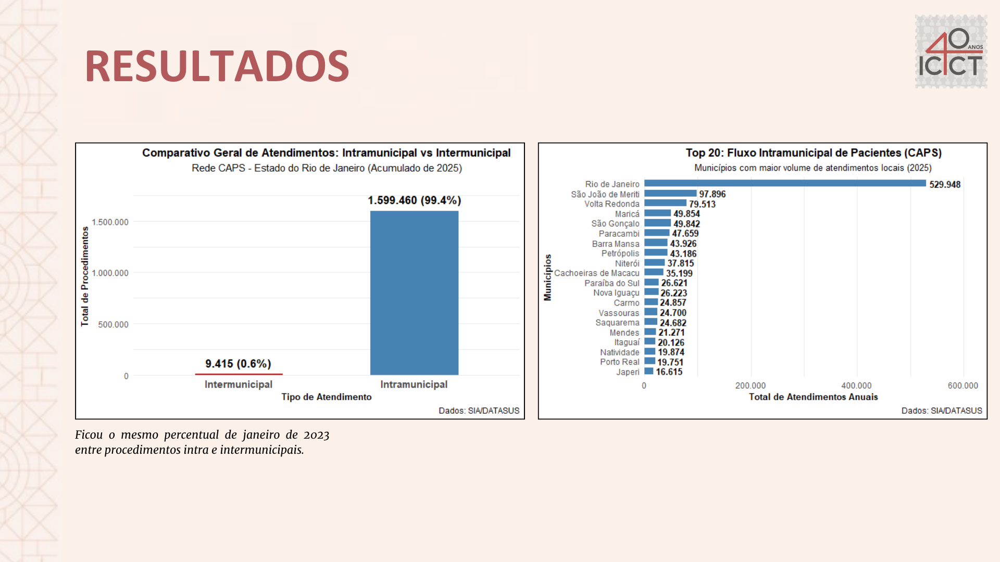

# Territorialização e Fluxos da Rede de Atenção Psicossocial (RAPS) no Estado do Rio de Janeiro
### Análise Espacial de Deslocamentos Ambulatoriais em CAPS utilizando Microdados do SIA/DATASUS (2025)
---

## 1. Contextualização e Objetivo:
* A regionalização, descentralização e hierarquização constituem princípios do Sistema Único de Saúde (SUS) para assegurar o acesso integrado, equitativo e territorializado aos serviços de saúde. No âmbito da Rede de Atenção Psicossocial (RAPS), os Centros de Atenção Psicossocial (CAPS) desempenham papel estratégico na oferta de cuidado comunitário às pessoas com sofrimento ou transtorno mental e necessidades decorrentes do uso prejudicial de álcool ou outras drogas.
* Este repositório apresenta o pipeline analítico e cartográfico desenvolvido para avaliar a territorialização e acessibilidade da Rede de Atenção Psicossocial (RAPS) no Estado do Rio de Janeiro em 2025. Por meio do processamento de 1.608.875 procedimentos ambulatoriais do SIA/DATASUS (Forma de Organização 03.01.08 do SIGTAP - Atendimento/Acompanhamento Psicossocial), o projeto mapeia matrizes de fluxo Origem-Destino (O-D) para quantificar a capacidade de retenção intra e intermunicipal da assistência dos CAPS a fim de diagnosticar áreas de vazio assistencial e dependência externa absoluta. O código visa oferecer ferramentas reprodutíveis de análise espacial para pesquisadores e gestores do Sistema Único de Saúde (SUS).
* Esse trabalho foi desenvolvido como Projeto Final do Curso de Inverno em Introdução à Linguagem R com Dados de Saúde, ofertado pelo ICICT/Fiocruz (professor Raphael Saldanha, desenvolvedor do pacote microdatasus), e foi submetido à publicação para o II Workshop de Geografia da Saúde da UERJ.
---

## 2. Destaques e Achados Territoriais:
* **Fluxo Intramunicipal (Alta Retenção):** Dos 1.608.875 procedimentos ambulatoriais de atenção psicossocial analisados no estado em 2025, **99,4%** ocorreram dentro do próprio município de residência do usuário. Esse índice evidencia uma expressiva eficácia geral da regionalização da RAPS no Rio de Janeiro, com redes locais absorvendo a quase totalidade da demanda e cumprindo a premissa do cuidado comunitário territorializado. Municípios como Rio de Janeiro, São João de Meriti e Volta Redonda lideram o ranking de maior volume absoluto de atendimentos à própria população.

* **Fluxo Intermunicipal (Vazios Assistenciais):** Os **0,6%** restantes do volume estadual (**n= 9.415**) corresponderam a deslocamentos intermunicipais, onde a maior parte dos municípios exportaram poucos procedimentos quando comparado ao seu volume total.
Para identificar se os deslocamentos intermunicipais eram relevantes ou não, foi criado uma tabela de porcentagem dos destinos que eram iguais a origem (==) do município e os que eram diferentes (!=).
* **Dependência Externa Absoluta (100%):** A análise de rede identificou municípios de pequeno porte com ausência ou insuficiência de fixação de cuidado local. **Varre-Sai** respondeu por **7,32%** de todo o tráfego intermunicipal fluminense, encaminhando 100% de sua demanda psicossocial para fora (sendo 99,7% absorvidos pelo município vizinho de Natividade) Da mesma forma, **Rio das Flores** apresentou 100% de dependência assistencial externa, exportando integralmente seus pacientes para Valença. O terceiro município que mais exportou pacientes foi Quatis, com **47,1%** dos procedimentos realizados em outras localidades (**n= 178**).
obs.: Municípios que apresentaram 100% de dependência, mas tiveram baixo fluxo de procedimentos foram desconsiderados.
